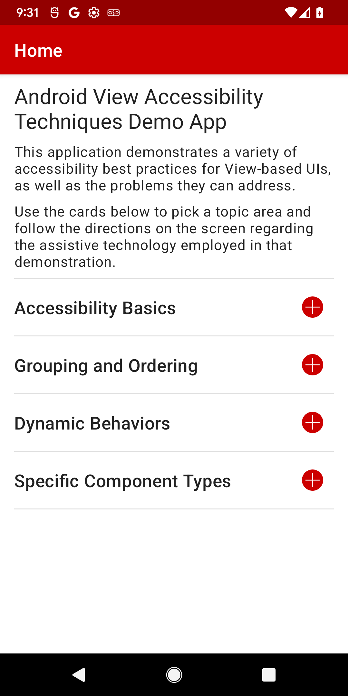
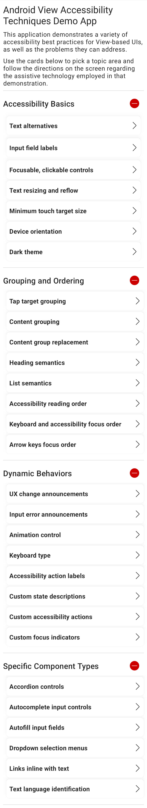

# android-view-accessibility-techniques

Demonstrates a variety of accessibility best practices for Android View-based UIs, as well as the problems they can address.
Using the app will demonstrate the impact of accessibility best practices, and reviewing the app project source code will help you learn how to apply those techniques in working code.

See [android-view-accessibility-techniques Architecture](ARCHITECTURE.md) for details of the app architecture and the project's file structure.

Since some of the code demonstrates the effect of inaccessible coding practices, the app itself does not fully conform to required accessibility guidelines.

## Topics
- Accessibility Basics
  - [x] [Text alternatives](doc/basics/TextAlternatives.md)
  - [x] [Input field labels](doc/basics/InputFieldLabels.md)
  - [x] [Focusable, clickable controls](doc/basics/FocusableClickableControls.md)
  - [x] [Text resizing and reflow](doc/basics/TextResizingAndReflow.md)
  - [x] [Minimum touch target size](doc/basics/MinimumTouchTargetSize.md)
  - [x] [Device orientation](doc/basics/DeviceOrientation.md)
  - [x] [Dark theme](doc/basics/DarkTheme.md)
- Grouping and Ordering
  - [x] [Tap target grouping](doc/grouping/TapTargetGrouping.md)
  - [x] [Content grouping](doc/grouping/ContentGrouping.md)
  - [x] [Content group replacement](doc/grouping/ContentGroupReplacement.md)
  - [x] [Heading semantics](doc/grouping/HeadingSemantics.md)
  - [x] [List semantics](doc/grouping/ListSemantics.md)
  - [x] [Accessibility reading order](doc/grouping/AccessibilityReadingOrder.md)
  - [x] [Keyboard and accessibility focus order](doc/grouping/KeyboardAndAccessibilityFocusOrder.md)
  - [x] [Arrow key focus order](doc/grouping/ArrowKeyFocusOrder.md)
- Dynamic Behaviors
  - [x] [UX change announcements](doc/dynamicbehaviors/UXChangeAnnouncements.md)
  - [x] [Input error announcements](doc/dynamicbehaviors/InputErrorAnnouncements.md)
  - [x] [Animation control](doc/dynamicbehaviors/AnimationControl.md)
  - [x] [Keyboard types](doc/dynamicbehaviors/KeyboardTypes.md)
  - [x] [Accessibility action labels](doc/dynamicbehaviors/AccessibilityActionLabels.md)
  - [x] [Custom state descriptions](doc/dynamicbehaviors/CustomStateDescriptions.md)
  - [x] [Custom accessibility actions](doc/dynamicbehaviors/CustomAccessibilityActions.md)
  - [x] [Custom focus indicators](doc/dynamicbehaviors/CustomFocusIndicators.md)
- Specific Component Types
  - [x] [Accordion controls](doc/componenttypes/AccordionControls.md)
  - [x] [Autocomplete input controls](doc/componenttypes/AutocompleteInputControls.md)
  - [x] [Autofill input fields](doc/componenttypes/AutofillInputFields.md)
  - [x] [Dropdown selection menus](doc/componenttypes/DropdownSelectionMenus.md)
  - [x] [Links inline with text](doc/componenttypes/LinksInlineWithText.md)
  - [x] [Text language identification](doc/componenttypes/TextLanguageIdentification.md)
- Other
  - [x] [Espresso Accessibility Checks automated testing](doc/EspressoAutomatedAccessibilityTesting.md)
    - See also `app/build.gradle`, `AccessibilityChecksTestRunner.kt`, and `InputFieldLabelsTests.kt`.

## Screenshots

## License
android-view-accessibility-techniques is licensed under under the Apache License, Version 2.0.  See LICENSE file for more information. 

Copyright 2023 CVS Health and/or one of its affiliates

Licensed under the Apache License, Version 2.0 (the "License");
you may not use this file except in compliance with the License.
You may obtain a copy of the License at
[http://www.apache.org/licenses/LICENSE-2.0]()

Unless required by applicable law or agreed to in writing, software
distributed under the License is distributed on an "AS IS" BASIS,
WITHOUT WARRANTIES OR CONDITIONS OF ANY KIND, either express or implied.

See the License for the specific language governing permissions and
limitations under the License.
